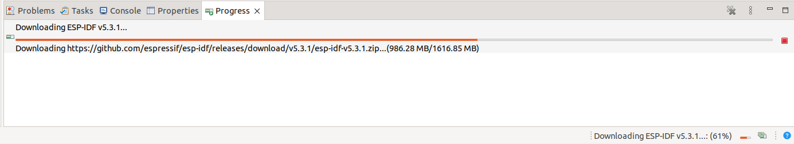

## Download [the latest Espressid-IDE for Linux](https://dl.espressif.com/dl/idf-eclipse-plugin/ide/Espressif-IDE-linux.gtk.x86_64/latest)

## Extract the tar gunzip file in the home directory`
`tar xvf ~/Downloads/Espressif-IDE-*.tar.gz -C ~ # Extract the tar gunzip file in the home directory`
## Create a symbolic link
`sudo ln -s ~/Espressif-IDE/espressif-ide /usr/local/bin/ # Create a symbolic link`

## Create a desktop entry for Espressif-IDE

```
echo '[Desktop Entry]
Version = 3.0.0
Type = Application
Terminal = false
Name = Espressif-IDE
Exec = /usr/local/bin/espressif-ide 
Icon = /home/<user-who-installed-Espressif>/Espressif-IDE/icon.xpm
Categories = Education;' | sudo tee /usr/share/applications/Espressif-IDE.desktop # Create a desktop entry for Espressif-IDE
```

## Install cmake
`sudo nala install cmake # Install cmake`

## Allow dialout

`sudo usermod -a -G dialout $USER`

## Configure Espressif-IDF

### 1-Open Espressif-IDF and select a separate directory for the ESP32's workspace

### 2-Check for updates


### 3-Restart to apply updates


### 4-Open ESP-IDF Manager

**First close the Welcome tab**. Else it will completely hide the ESP-IDF Manager tab / tile


### 5-Download ESP-IDF


View the progress of the download should in the Progress tab




### Handle rule errors

If you get "[Unable to copy rules for OpenOCD to system directory, try running the eclipse with sudo command](https://github.com/espressif/idf-eclipse-plugin/issues/777#issuecomment-1574885512)", 


Copy [this 60-openocd.rules file](https://github.com/espressif/openocd-esp32/blob/master/contrib/60-openocd.rules) to `/etc/udev/rules.d/` manually after changing its owner and group to `root:root`

### 6-Create New Espressif IDF project


