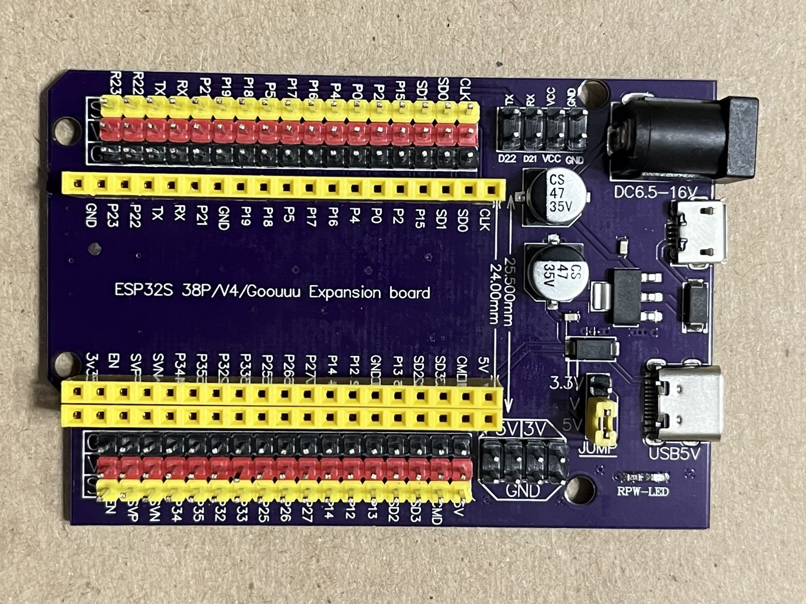

# Overview
This expansion baseboard takes **38-pin ESP32 DevKitC v4** type development modules and brings the I/O out to a series of headers along with power and ground.

# Key Features

## Look and fit

1. Supports both 0.9″ (24mm) as well as 1.0″ (25.5mm) wide ESP-32 38-pin modules
1. Board Dimensions (PCB): L x W = 77 x 54mm (3″ x 2.13″)
1. Pins are labeled legibly
1. Provides easy to use male header pin for power, ground and signal for each I/O pin to connect various modules and sensors
1. Four M4 size mounting holes are provided, with some being very close to the edge of the PCB and may be partially broken out, but will still work to secure the module. Consider using plastic screws of zip ties

## Power

## Powering the baseboard

Supports 4 ways to power the ESP32 module. **Only one** of them should be used at any time to power the board. A red LED `pwr` lights up when power is supplied.
1. Via a barrel jack
    - accepts 6.5V to 16V DC power.
    - an on-board 5V regulator provides the 5V power
    - recommended to keep the input voltage down to a maximum of 12V to limit power dissipation in the on-board 5V linear regulator
1. Via a USB-C port
    - the 5V power comes straight from the USB after passing through a reverse current protection diode
    - **does not** support programming the ESP32 or monitoring the serial output
1. Via a USB Micro-B port
    - the 5V power comes straight from the USB after passing through a reverse current protection diode
    - **does not** support programming the ESP32 or monitoring the serial output
1. Via the USB Micro-B cable connected directly to the ESP32
    - there are reverse current protection diodes in place both on the ESP32 and the baseboard, so it is safe to connect to the ESP32 USB
    - this is the **only way to program the ESP32 or monitor the serial output**
    - if connecting any peripheral devices, please be within the current limits of the ESP32's onboard regulator (e.g. **should not exceed 250mA** for the 3.3V pin) 
      
## Powering peripheral devices
1. Power rails can either be configured to take 5V or 3.3V by **positioning the jumper shunt cap** of the jumper labeled *JUMP* appropriately. Without this jumper while the ESP32 will power up, there will be **absolutely no power** in the power rails and the Vcc pins
    - If powering a periperal that works only on 5V (e.g. a 1602 LCD) then this jumper should be at 5V
1. Power rails on either side as well as Vcc pins will be at the same voltage
1. A header block behind the barrel jack brings out the TX/RX and I2C SDA/SCL (D21/D22) as well as power and ground. This Vcc voltage will change based on the position of the *JUMP* jumper
1. A separate header block behind the *JUMP* jumper, brings out both 3.3V and 5V as well as GND
    - These pins are independent of the jumper position
    - However, since the 3.3V pin is powered by the regulator on the ESP32 module, it will not read any power unless an ESP32 module is connected to the baseboard

### Notes on Baseboard 3.3V Power
1. The 3.3V power on the baseboard is provided by the 3.3V regulator on the ESP32 module. Typically, the current drawn off this regulator **should not exceed 250mA**. Without an ESP32 module mounted on the baseboard, there will be no 3.3V power available.
1. **Bear in mind** that the ESP32 is a 3.3V logic level compatible only device. Therefore the Logic-high voltage for the signal pin will only be 3.3V irrespective of the position of this jumper

### References
[Product Description from protosupplies](https://protosupplies.com/product/esp32-s-expansion-board-38-pin/)
