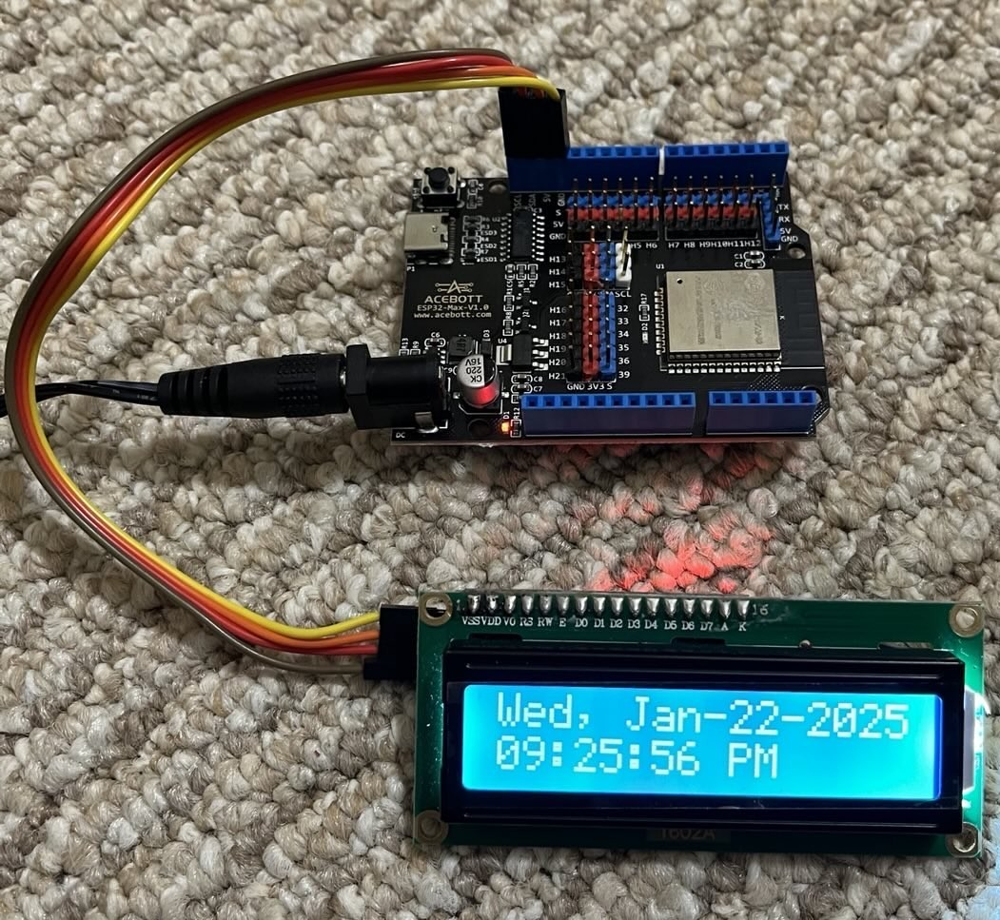

ESP-IDF template app
====================

This is a template application to be used with [Espressif IoT Development Framework](https://github.com/espressif/esp-idf).

Please check [ESP-IDF docs](https://docs.espressif.com/projects/esp-idf/en/latest/get-started/index.html) for getting started instructions.

*Code in this repository is in the Public Domain (or CC0 licensed, at your option.)
Unless required by applicable law or agreed to in writing, this
software is distributed on an "AS IS" BASIS, WITHOUT WARRANTIES OR
CONDITIONS OF ANY KIND, either express or implied.*

# NTP Timepiece

## Overview

This NTP timepiece connects to the home WiFi as soon as it’s powered up and sets its in-built RTC by getting the time from an NTP server. It has no back up battery as it will always do this as soon as its power is restored.

## Next steps

The enhancement plan is as follows 
1.  as soon as it is powered up, it should first allow for set-up by
    - hosting a wifi access point by itself to which you can connect to and provide the 'set-up' information
    - taking the credentials of the wifi router to which it can connect to the internet ('set-up' information 1)
    - taking the time zone for which it to show time ('set-up' information 2)
1.  it will then connect to the internet via that router and then pick up the time from the NTP server and set itself and keep going.
   

## References from Examples as below

[Esp32 sntp esp-idf synchronize time ntp - Esp32tutorials.com](https://esp32tutorials.com/esp32-sntp-esp-idf-synchronize-time-ntp/)

[Esp32 web-server esp-idf Esp32tutorials.com](https://esp32tutorials.com/esp32-web-server-esp-idf/)

[Espressif esp-idf - Examples protocols SNTP](https://github.com/espressif/esp-idf/tree/master/examples/protocols/sntp)

[Getting started with wifi on esp-idf](https://developer.espressif.com/blog/getting-started-with-wifi-on-esp-idf/)
