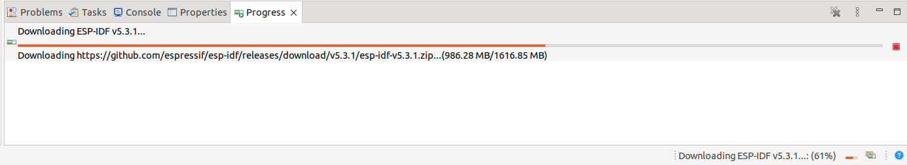

# Why these instructions

The [ESP-IDF Eclipse Plugin (Espressif-IDE) installation](https://github.com/espressif/idf-eclipse-plugin/blob/master/README.md#Installation) page provides anywhere between **minimal to no instructions** on installing **Espressif-IDE instead of the Eclipse CDT + IEP Plugin update approach** and especially for *Linux*. All screenshots they provide are for the *Eclipse CDT + IEP Plugin update approach* and that too with some dated ones on *Help > Install New Software* for Mac. The [Espressif-IDE](https://github.com/espressif/idf-eclipse-plugin/blob/master/docs_readme/Espressif-IDE.md) page provides no more than a [Download](https://github.com/espressif/idf-eclipse-plugin/blob/master/docs_readme/Espressif-IDE.md#downloads) link to the latest [Espressif-IDE-linux.gtk.x86_64](https://dl.espressif.com/dl/idf-eclipse-plugin/ide/Espressif-IDE-linux.gtk.x86_64/latest) release or for *Installing Espressif-IDE by Windows Offline Installer*


## Pre-requisites


```
$ which java
/usr/bin/java

$ which git
/usr/bin/git

$ which python # This will show an empty result, which is good

$ which python3
/usr/bin/python3
```

The below are **python and pip requirements** for the steps that follow

`sudo nala install python3-pip # This may already be met`

`# sudo nala install python-is-python3 # This is not required` **Do not install python-is-python3**

`# sudo nala install cmake # This is not required` **Do not install cmake**


The below is the **summary of all pre-requisites met** by the steps that follow

```
$ java --version
openjdk 19.0.2 2023-01-17
OpenJDK Runtime Environment (build 19.0.2+7-Ubuntu-0ubuntu322.04)
OpenJDK 64-Bit Server VM (build 19.0.2+7-Ubuntu-0ubuntu322.04, mixed mode, sharing)

$ pip3 --version
pip 23.3.2 from /usr/local/lib/python3.10/dist-packages/pip (python 3.10)

$ lsb_release -a
No LSB modules are available.
Distributor ID:	Ubuntu
Description:	Ubuntu 22.04.5 LTS
Release:	22.04
Codename:	jammy

$ uname -r
6.8.0-45-generic
```


## Download [the latest Espressid-IDE for Linux](https://dl.espressif.com/dl/idf-eclipse-plugin/ide/Espressif-IDE-linux.gtk.x86_64/latest)

## Extract the tar gunzip file in the home directory`
`tar xvf ~/Downloads/Espressif-IDE-*.tar.gz -C ~ # Extract the tar gunzip file in the home directory`

**Note:** `Espressif-IDE-3.0.0-linux.gtk.x86_64.tar.gz` was used for this installation

## Create a symbolic link
`sudo ln -s ~/Espressif-IDE/espressif-ide /usr/local/bin/ # Create a symbolic link`

## Create a desktop entry for Espressif-IDE

Edit the path correctly in `Icon = /home/<user-who-installed-Espressif>`

```
echo '[Desktop Entry]
Version = 3.0.0
Type = Application
Terminal = false
Name = Espressif-IDE
Exec = /usr/local/bin/espressif-ide 
Icon = /home/<user-who-installed-Espressif>/Espressif-IDE/icon.xpm
Categories = Education;' | sudo tee /usr/share/applications/Espressif-IDE.desktop # Create a desktop entry for Espressif-IDE
```

## Allow dialout

`sudo usermod -a -G dialout $USER`

## Configure Espressif-IDF

### 1-Open Espressif-IDF and select a separate directory for the ESP32's workspace


### 2-Check and install updates


### 3-Restart to apply updates


### 4-Open ESP-IDF Manager

**First close the Welcome tab**. Else it will completely hide the ESP-IDF Manager tab / tile


### 5-Download ESP-IDF


View the progress of the download should in the Progress tab




### Handle rule errors

#### If you get "[Unable to copy rules for OpenOCD to system directory, try running the eclipse with sudo command](https://github.com/espressif/idf-eclipse-plugin/issues/777#issuecomment-1574885512)", 


Copy [this 60-openocd.rules file](https://github.com/espressif/openocd-esp32/blob/master/contrib/60-openocd.rules) to `/etc/udev/rules.d/` manually after changing its owner and group to `root:root` . A copy is also [available in this repo](./60-openocd.rules)

#### If this OpenOCD rules file exists, for this warning click "No" to not overwrite it


And after clicking **No** the Tool will be activated with the existing OpenOCD rules file


### 6-Create New Espressif IDF project


## How to uninstall?

This approach ***assumes the user's home to be the location*** of the Espressif_IDE or Eclipse IDE installation

**Note:** Close Espressif-IDE or Eclipse IDE prior to uninstallation. 

`ls -al ~ # List all folder and files including hidden ones under the user's home`

`rm -rf ~/esp-idf* # Remove the esp idf such as esp-idf-v5.3.1`

`rm -rf ~/.espressif/  # Remove the espressif hidden folder`

`rm -rf ~/ESP32-workspace/ # Remove the ESP32 workspace if needed`

### If Espressif-IDE needs to be uninstalled
`rm -rf ~/Espressif-IDE/ # Remove the Espressif IDE`

`sudo rm /usr/share/applications/Espressif-IDE.desktop # Remove the Espressif IDE desktop file`

`ls -l /usr/local/bin/espressif-ide # Remove the symbolic link to the Espressif IDE desktop file`

### If Eclipse-IDE needs to be uninstalled
`rm -rf eclipse-installation/ # Remove the Eclipse IDE if Eclipse needs to be removed`

`sudo rm /usr/share/applications/eclipse.desktop # Remove the Eclipse IDE desktop file if Eclipse needs to be removed`

`ls -l /usr/local/bin/eclipse-ide # Remove the symbolic link to the Eclipse IDE desktop file if Eclipse needs to be removed`


## References

### Eclipse with GitHub
[Tutorial on how to use Eclipse with GitHub](https://github.com/maxkratz/How-to-Eclipse-with-Github)


