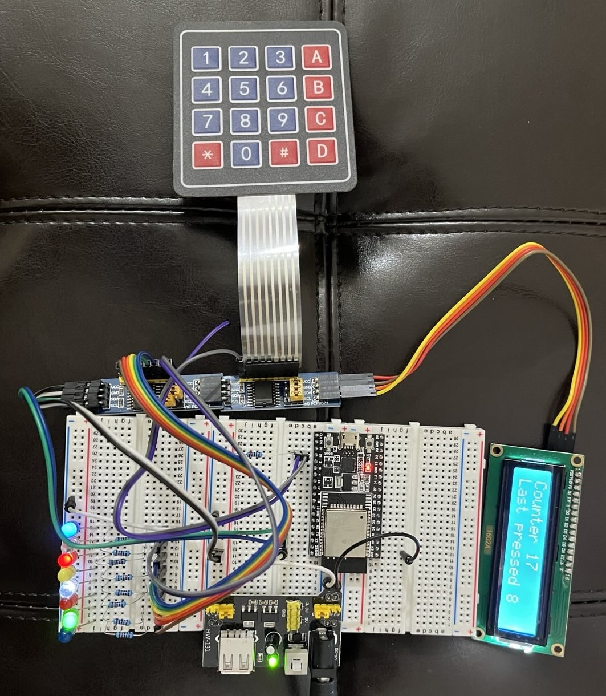

# i2c Daisy Chaining PCF8574 with 8 LEDs, a 4x4 membrane matrix keypad and an LCD1602 

## About this project

This project __Daisy Chains__ the following devices with __PCF8574 / PCF8574T I/O expanders__ for the __i2c bus__, and implements some interesting functionality showing in the sub-bulleted points below. It 

1. Scans for i2c devices
2. Reads bytes from PCF8574 pins
3. Writes bytes to PCF8574 pins
4. Uses TAGs and __Queues__
	1. Uses a TAG as "Matrix Keypad" to capture key strokes on the matric keypad and send them to the LCD
 	2. Uses a TAG as "PCF8574" to push the 8-bit string to blick the LED lights every 0.5 second
5. Assigns addresses for each i2c devices and reads from / writes to them (see each assigned address as below)
6. Blinks 8 LEDs of different colors
	1. Does a shift left of the bit pattern "0x55" whose binary is "01010101" continously with a delay of 1/2 a second and refreshes it upon "00000000"
 	2. At PCF8574_SLAVE_ADDR = __0x21__ _// A0 jumper to ground_
7. Reads from a 4x4 membrane matrix keypad
	1. At PCF8574_SLAVE_KPD_ADDRESS = __0x20__ _// No jumper set for keypad on PCF8574 expander_
 	2. __uses interrupts__ to recognize key strokes
 	3. uses some rudimentary logic to __debounce key strokes__
  	4. reads which key is pressed by masking the keypad's rows and columns 
8. Writes to an LCD1602
	1. At LCD Address = __0x27__ _// The same as 0x4E>>1_
	2. Writes a standard text on the first line
 	3. Writes the key strokes pressed on the second line
 
### References and courtesy credits
1. Reading from PCF8574 pins / i2c Tutorial - https://embeddedexplorer.com/esp32-i2c-tutorial/
2. The LCD 1602A is based on the Hitachi HD44780 LCD controller. Refer
   - https://mil.ufl.edu/3744/docs/lcdmanual/commands.html#Sda 
   - https://exploreembedded.com/wiki/Interfacing_LCD_in_4-bit_mode_with_8051
   - https://embeddedexpert.io/?p=600 RS=0 is to select command register
   - https://embeddedexpert.io/?p=655 for RS and EN pin
   - https://www.instructables.com/HD44780-LCD-to-I2C-adapter-board-for-the-Bus-Pirat/ - Pin connection order in the notation LCD connection (to PCF8574 pin) is D7(P7), D6(P6), D5(P5), D4(P4), VEE(P3), EN(P2), RW (P1), RS (P0)
   - https://www.elprocus.com/lcd-16x2-pin-configuration-and-its-working/ - The VEE pin regulates the display's contrast, via a changeable POT that can supply 0 to 5V
   - https://www.sparkfun.com/datasheets/LCD/HD44780.pdf - command set of the LCD 1602A which is based on the Hitachi HD44780 LCD controller. The initialisation pattern is shown in page 46 of the datasheet
4. i2c Clock speed - https://www.i2c-bus.org/speed/
5. i2c LCD Displaying Weird Characters - 400KHz SolveD - https://arduino.stackexchange.com/questions/19150/i2c-lcd-displaying-weird-characters
6. Scanning for i2c devices - https://gist.github.com/herzig/8d4c13d8b81a77ac86481c6c1306bb12
7. GPIO interrupts - https://esp32tutorials.com/esp32-gpio-interrupts-esp-idf/


## Steps to import into Eclipse "Espressif IDF Project"

1.  Download the contents of the "i2c_daisy_chain" folder from github as a zip file. The parent level should have __this__ "ReadMe.md" file, a "CMakeLists.txt". The "main" folder with 11 files (.c , .h and others) should be a sub-folder under the parent fine.
	- __Note :__ You have to download a bigger zip file of the repo and then remove unnecessary files from it to create this zip file.
  


2.  Create a new "Espressif IDF Project" in Eclipse and name it "i2c-daisy-chain"


3.  Click "File -> Import" and open the "Import Wizard"


4.  Import the contents of zip file into this project


5.  Agree to overwrite CMakeLists.txt and all contents by clicking **Yes To All**


6.  Build the new project


_6.1 Build Successful_


7.  Flash the binaries to the ESP32 chip

_7.1 Configure Serial port_

If you clicked `Launch in Run mode` without configuring the serial port, you will get a `Serial port not found` error below


_7.2 Select ESP Target_


_7.3 Select serial port_


_7.4 Setup the ESP Target_


_7.5 Flash the binaries to the ESP32 chip_


## Fritzing circuit image


## Photos of circuit without 4x4 membrane matrix keypad

### 1. ESP32 DevKitC-v4 connected to PCF8574 and HW-131 Power Supply Module 



### 2. LCD1602 daisy-chained via i2c to PCF8574


### 3. 8-LEDs on common GND connected to VCC via separate 10k resistors


### 4. Closer look of resistors and VCC jumper wires from PCF8574 pinouts


### 5. Working LCD1602 and string of LEDs


## References to upgrading versions
### ESP-IDF - from 4.4 to 5.0
[ESP-IDF » Migration Guides » Migration from 4.4 to 5.0 » Build System](https://docs.espressif.com/projects/esp-idf/en/latest/esp32/migration-guides/release-5.x/5.0/build-system.html)  - This will work for esp-idf v5.3.1 or v5.3.2 as targets

Add `#include "esp_timer.h"` wherever needed

Change `gpio_pad_select_gpio` to `esp_rom_gpio_pad_select_gpio`

#### CMakeLists.txt related
[C++ multiple definition linker issue with ESP-IDF](https://stackoverflow.com/questions/77633054/c-multiple-definition-linker-issue-with-esp-idf)

Edit the `CMakeLists.txt` inside the `main` folder as below

```
# See the build system documentation in IDF programming guide
# for more information about component CMakeLists.txt files.

idf_component_register(
    SRCS 
    	# list the source files of this component
       	i2c_daisy_chain_main.c 
	i2c_port.c 
	i2c_LCD.c 
	PCF8574.c
	i2c-matrix-keypad.c
    INCLUDE_DIRS   .    # optional, add here public include directories
    PRIV_INCLUDE_DIRS   # optional, add here private include directories
    REQUIRES            # optional, list the public requirements (component names)
    PRIV_REQUIRES       # optional, list the private requirements
)
```

#### Header files `*.h`

Declare the variables as `extern` in the various / respective header files to address the following build / compilation errors
```
multiple definition of `err';
multiple definition of `blinkDuration';
multiple definition of `keyQueue'; 
```

`extern esp_err_t err;`

`extern long blinkDuration; // in microseconds`

`extern QueueHandle_t keyQueue; // used for storing what is read from PCF8574 keypad`


### FreeRTOS - from FreeRTOS V7.x.x to V8.x.x
[New FreeRTOS Defined typedefs Names](https://freertos.org/Documentation/04-Roadmap-and-release-note/02-Release-notes/01-FreeRTOS-V8#new-freertos-defined-typedefs-names)

Add `#include "stdint.h"` to process `uint8_t` wherever needed

Change `xQueueHandle` to `QueueHandle_t`

Change `portTickType` to `TickType_t`

Change `portTICK_RATE_MS` to `portTICK_PERIOD_MS`


### Compiler error when adding code into 'components'.
[fatal error: driver/i2c.h: No such file or directory | #include <driver/i2c.h>](https://esp32.com/viewtopic.php?t=29660) - This was not required to be implemented in the `CMakeLists.txt`. Use this link only as a reference
