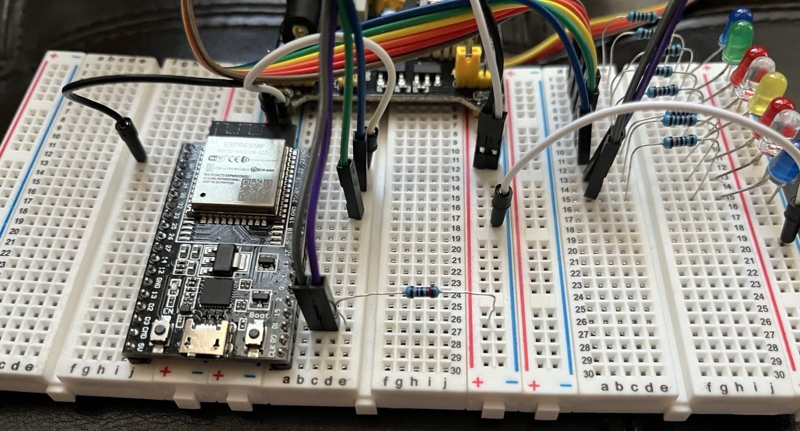

# i2c Daisy Chaining LCD1602 and 8 LED bulbs to PCF8574

## Steps to import into Eclipse "Espressif IDF Project"

1.  Download the contents of the "i2c_daisy_chain" folder from github as a zip file. The parent level should have this "ReadMe.md" file, "Makefile" and a "CMakeLists.txt". The "main" folder with 11 files (.c , .h and others) should be a sub-folder under the parent fine
1.  Create a new "Espressif IDF Project" in Eclipse. Import the contents of zip file into this project and agree to overwrite all contents.
1.  Build the new project.

## Photos of circuit

### 1

### 2

### 3

### 4

### 5

