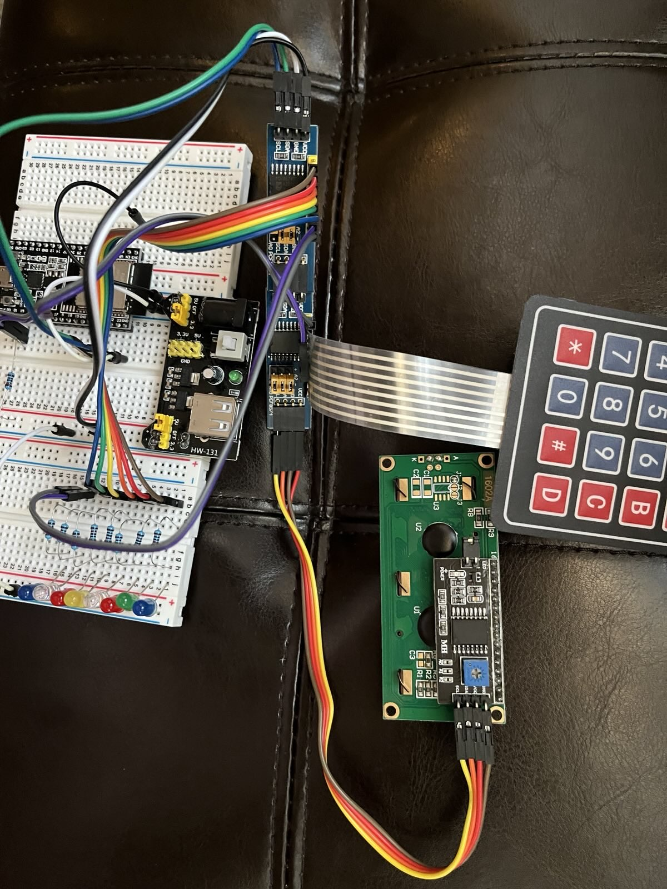
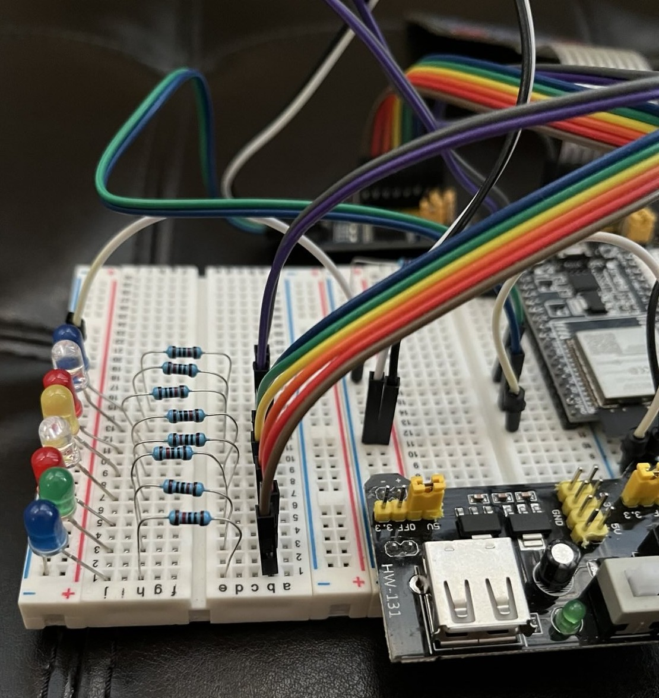

# i2c Daisy Chaining PCF8574 with 8 LEDs, a 4x4 membrane matrix keypad and a LCD1602 

## Steps to import into Eclipse "Espressif IDF Project"

1.  Download the contents of the "i2c_daisy_chain" folder from github as a zip file. The parent level should have this "ReadMe.md" file, "Makefile" and a "CMakeLists.txt". The "main" folder with 11 files (.c , .h and others) should be a sub-folder under the parent fine
  

2.  Create a new "Espressif IDF Project" in Eclipse

3.  Import the contents of zip file into this project

4.  Agree to overwrite CMakeLists.txt and all contents by clicking **Yes To All**

5.  Build the new project

## Fritzing circuit image

## Photos of circuit without 4x4 membrane matrix keypad

### 1. ESP32 DevKitC-v4 connected to PCF8574 and HW-131 Power Supply Module 

### 2. LCD1602 daisy-chained via i2c to PCF8574

### 3. 8-LEDs on common GND connected to VCC via separate 10k resistors

### 4. Closer look of resistors and VCC jumper wires from PCF8574 pinouts

### 5. Working LCD1602 and string of LEDs

